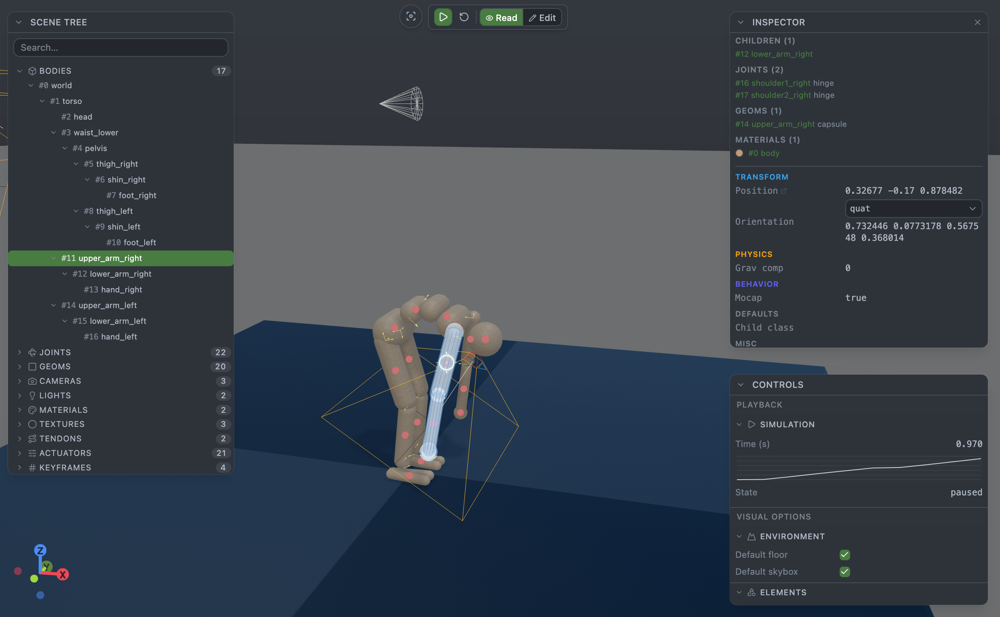

# MuJoCo Viewer

**Live 3D previews, edits, and debugging for MuJoCo models — inside VS Code, Cursor, Windsurf & any other VS Code-based IDE.**

Open any MJCF `.xml` and watch the simulation respond as you type. The extension handles `<include>` resolution, mesh / texture / heightfield loading, compile-error feedback, gizmo edits that round-trip to the XML as undoable edits, and a full inspector surface (bodies, joints, actuators, cameras, lights, materials, tendons, keyframes).



This repo is a monorepo with the extension, a browser debug harness, and the underlying Svelte 5 + Threlte + WASM library that powers both.

- **Extension users** → install from the [VS Code Marketplace](https://marketplace.visualstudio.com/items?itemName=julienblanchon.mujoco-viewer) (VS Code) or [Open VSX](https://open-vsx.org/extension/julienblanchon/mujoco-viewer) (Cursor / Windsurf / VSCodium / code-server). Full install & usage docs in [`apps/vscode-extension/README.md`](apps/vscode-extension/README.md).
- **Contributors** → [`CONTRIBUTING.md`](CONTRIBUTING.md).
- **Library consumers** → [`packages/mujoco-svelte/README.md`](packages/mujoco-svelte/README.md).

## Layout

```
mujoco-viewer/
├── apps/vscode-extension/   VS Code extension (host + webview bundle)
├── debug/                   Standalone browser app (File System Access API)
├── packages/
│   ├── mujoco-svelte/       Threlte + MuJoCo WASM library
│   ├── viewer-ui/           Reusable viewer UI (scene, panels, edit session)
│   └── protocol/            HostAdapter interface + message types
├── assets/                  Marketing screenshots (not shipped)
└── schemas/                 MuJoCo XSD (shipped inside the extension)
```

The viewer UI never talks to a platform directly — it takes a `HostAdapter` (defined in `@mujoco-viewer/protocol`). The extension and the debug app each provide their own adapter on top of `<ViewerApp>`. See `CONTRIBUTING.md` for the full architecture diagram.

## Quick start

```bash
bun install
bun run --filter debug dev                       # browser-only (Chrome/Edge/Arc)
bun run --filter apps/vscode-extension dev       # then F5 to launch EDH
```

See [`CONTRIBUTING.md`](CONTRIBUTING.md) for the full dev workflow, and each package's README for package-specific notes.

## How the pieces fit

- **`mujoco-svelte`** — physics + rendering. Wraps the `mujoco-js` WASM build, exposes Threlte-flavored components, and resolves MJCF includes + assets via an optional `fileLoader` hook.
- **`@mujoco-viewer/viewer-ui`** — the whole viewer surface (scene, panels, inspectors, keyboard shortcuts, edit session). Top-level `<ViewerApp adapter={...}>` takes a `HostAdapter` and wires it into the scene loader and the save path.
- **`@mujoco-viewer/protocol`** — the shared contract: `HostAdapter` interface, `postMessage` message unions, `ViewerSettings`.
- **`apps/vscode-extension`** — host (Node) side talks VS Code APIs, webview side runs `<ViewerApp>` with a `postMessage`-backed adapter.
- **`debug/`** — browser-only counterpart. Its adapter is backed by `FileSystemDirectoryHandle`; everything else is the same code.

## Status

- VS Code extension: preview (`0.1.4`). Published on both the [VS Code Marketplace](https://marketplace.visualstudio.com/items?itemName=julienblanchon.mujoco-viewer) and [Open VSX](https://open-vsx.org/extension/julienblanchon/mujoco-viewer) so it installs on VS Code, Cursor, Windsurf, VSCodium, Gitpod, code-server, and other forks.
- Packages: workspace-internal. `mujoco-svelte` is the most externally-useful; API is stabilising.

## License

MIT — see [LICENSE](LICENSE). The bundled MuJoCo WASM is Apache-2.0 via [`mujoco-js`](https://www.npmjs.com/package/mujoco-js).
